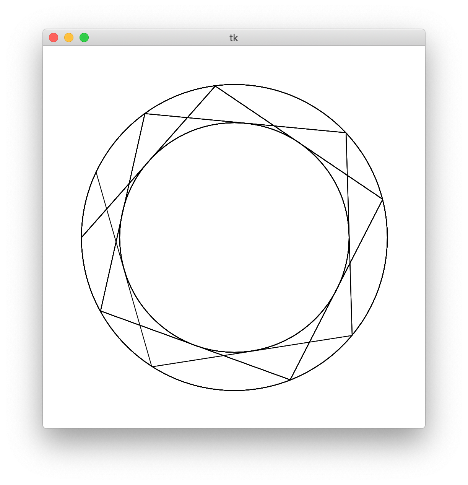

# Tangents

Generate two concentric circles and draw tangent lines.

This idea started in high school in 2011, revisited it in 2020.

Work in progress. Just for fun.

```bash

pip install -r requirements.txt

python tangents.py
```
